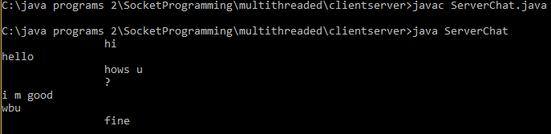
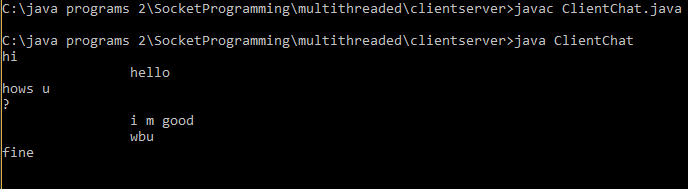

DESCRIPTION

A multithreaded client/server Chat application based on the console which uses Java Socket programming and multi-threading.

SERVER

1.Listens on the network and waits for any client to connect.

2.Once a client is connected can send message to the client or receive from the client.
Note:Multiple clients can be connected.

Client

1.Connects to the server on the local port no.

2.Can send and receive mesaages from the server.

SERVER OUTPUT

CLIENT OUTPUT

